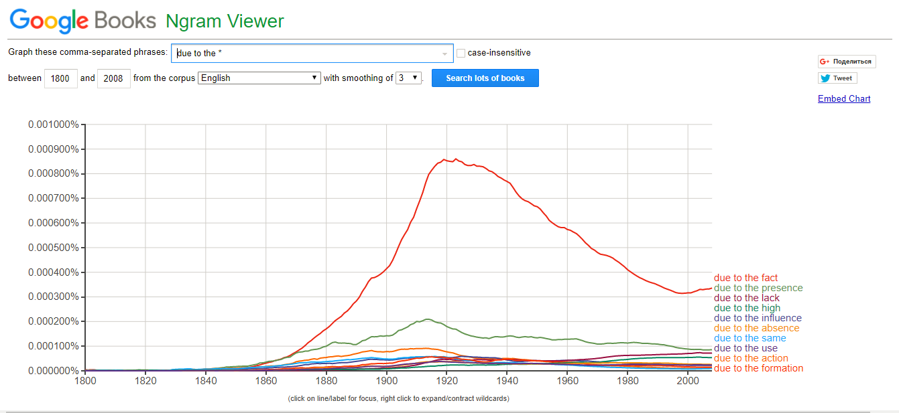
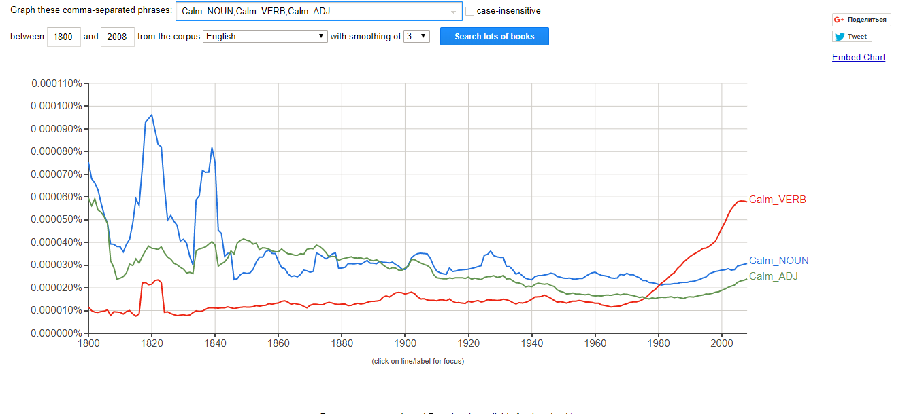
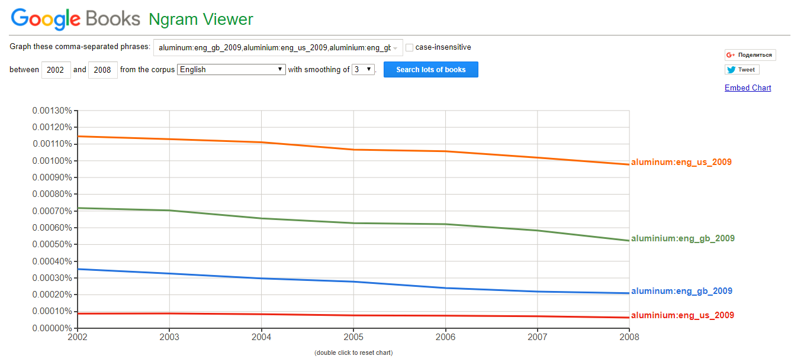
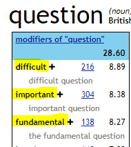
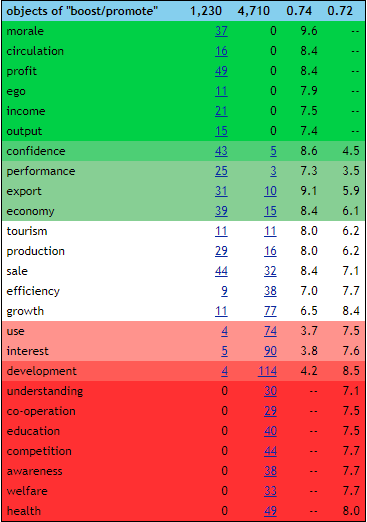

# hw6

### *10 Most Frequent Endings to "Due to the"*

### *Part-of-speech "Calm"*

### *British x American*

Результаты оправданы и могут быть подтверждены тем, что слово **«aluminum»** чаще встречается на американском английском языке, а слово **«aluminium»** чаще встречается на британском английском языке.

## Sketch Engine 

#### Most Frequent Modifiers

 
#### Object Usage

С этого мы увидим, что употребляются разные дополнения с глаглолами-синонимы *Boost/Promote*. Во-первых, в зеленой области отображены дополнения, которые чаще встречаются с глаголом "Boost", например слово
> "Morale" - "Boost morale". 

С другой стороны, красная область показывает дополнения, которые чаще встречаются с глаголом "Promote", к примеру слово 
> "Awareness" - "Promote awareness". 

Также имеются дополнения, которые встречаются с двумя глаголами более равномерно. Эти дополнения отображены в белой серединной области, к примеру слово 
> "Sales" - "Boost/Promote Sales".

#### Word: Excavations

##### British National Corpus (BNC)

##### Google NGram

